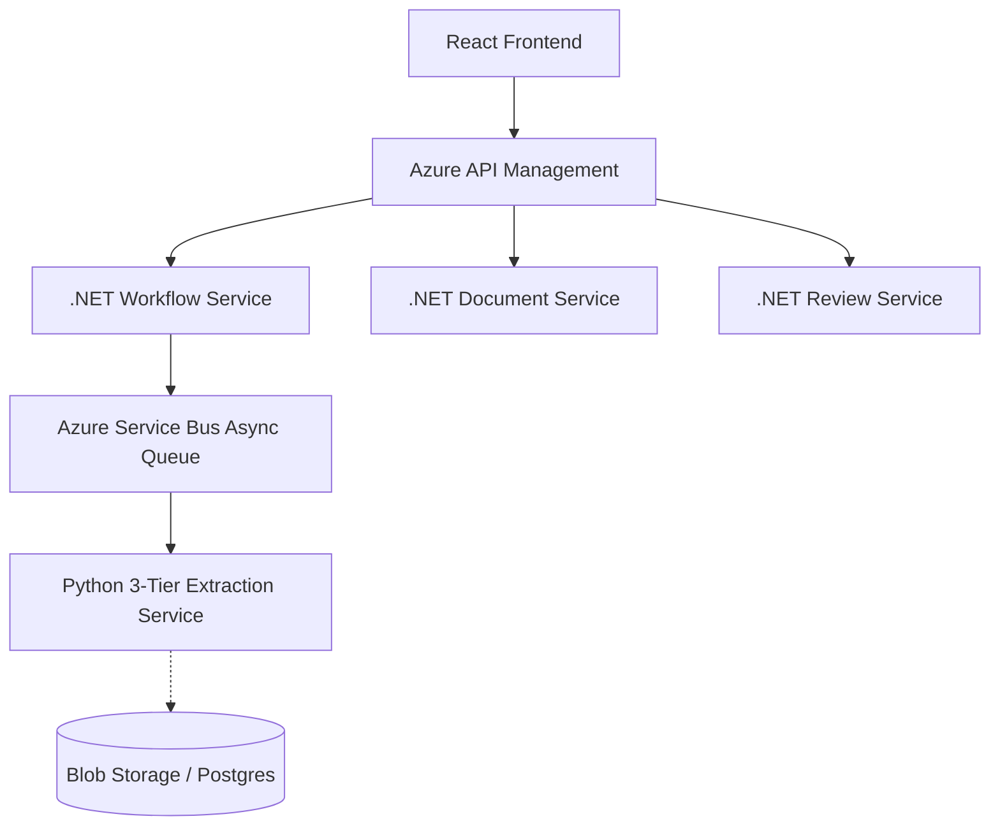

# Architecture Overview

Magic Tax Insight is designed with a **hybrid architecture**: the primary backend relies on **.NET** orchestration (handling business rules, auth, and state), while specialized AI/ML microservices handle complex data processing using **Python**.

## 1. System Overview

The .NET layer acts as the system of record and orchestrator. The Python layer acts as the "Intelligence Layer" consisting of independent Dockerized microservices.

## 2. The 3-Tier Extraction Pipeline

The standalone Python component implements a cutting-edge **3-tier extraction pipeline** (`src/tax_pipeline.py`) designed to handle everything from clean digital PDFs to complex, logic-heavy K-1 schemas:

### Tier 1: AI Layout Analysis (Docling)

Every document is first passed to the **Docling Strategy**. IBM Docling analyzes the structure of the document (headers, tables, key-value pairs) and extracts the text.

- If Docling processes the form and yields a **confidence score > 0.80**, the system stops here and returns the structured data.
- **Why?** It handles complex tables and nested regions exceptionally well without writing fragile local code.

### Tier 2: LLM Fallback (Gemini 2.0 Flash)

If a form is highly complex, unparseable via standard structures, or Docling yields low confidence, the page image is routed to multimodal LLMs (e.g., Gemini 2.0 Flash).

- Using **Structured Outputs**, the LLM converts the visual representation of the tax form directly into the schema mandated by `FormSchema`.
- **Why?** LLMs excel at edge cases, handwritten documents, and logical inference (like mapping a K-1 Box 16 code to a specific description).

### Tier 3: Local Strategy (Dedicated Parsers)

For exceptionally clean digital PDFs (where AI is overkill) or heavily standardized forms (like W-2s), the pipeline falls back to highly-optimized local regex parsers powered by **pdfplumber**.

- Relies on scripts in `src/parsers/` to aggressively pattern-match line items.
- **Why?** It's computationally cheap, blazing fast, and 100% deterministic.

### Data Serialization

Once the strategies finish executing, the resulting `ExtractedForm` objects are recursively serialized out as JSON.

## 3. Classification at Scale: The Composed Envelope

One major challenge is Azure Document Intelligence limits (2 GB or 25,000 pages max). Magic Tax Insight gets around this by using **Composed Classifier Ensembles**.
Instead of monolithic endpoints, 75+ documents are split into 10 smaller functional groups (Identity, Income, Property, Closing, etc.). They are trained independently and mapped via a single Master Classifier endpoint, ensuring scale, efficiency, and small blast radiuses for bad retrains.
